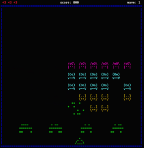
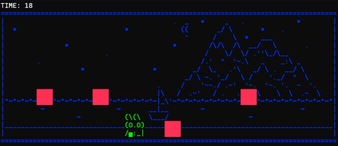
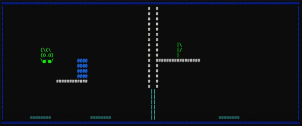

# TERME

An engine for creating 2D terminal rendered games.<br>
Some usage examples can be found in the [Terme Examples Repo](https://github.com/nico-bertoli/terme_examples)

## Main features
- Cross platform (Linux/Windows)
- Framerate-independent simulation
- Collision system with OnCollisionEnter/Exit events
- Sorting layers
- Particle effects
- Backgrounds support

## Preview
Trailer available [here](https://www.youtube.com/watch?v=TqpGVI95oNU&ab_channel=Nicol%C3%B2Bertoli) <br><br>





## Installation

Update your conanfile.py:
```python
    def requirements(self):
        self.requires("terme/1.0.0@local/stable")
    
    def configure(self):
        if "sfml" in self.options:
            self.options["sfml"].shared = False
```

Update your bash build file to download the package from GitHub:
```bash
if ! conan search terme/1.0.0@local/stable 2>/dev/null | grep -q "Package_ID"; then
    echo "Creating terme package from GitHub..."
    TMP_DIR=$(mktemp -d)
    git clone --depth 1 https://github.com/nico-bertoli/terme.git "$TMP_DIR/terme"
    conan create "$TMP_DIR/terme/terme" --name=terme --version=1.0.0 --user=local --channel=stable
    rm -rf "$TMP_DIR"
fi
```

Link the library in CMake:
```cmake
find_package(terme REQUIRED)

target_link_libraries(your_target PRIVATE terme::terme)
```

#
This project uses SFML for handling sounds: https://www.sfml-dev.org

SFML is developed by Laurent Gomila and contributors.
Copyright (C) 2007-2023 Laurent Gomila - laurent@sfml-dev.org
SFML is licensed under the zlib/libpng license.
