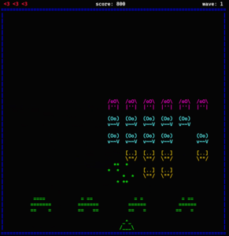
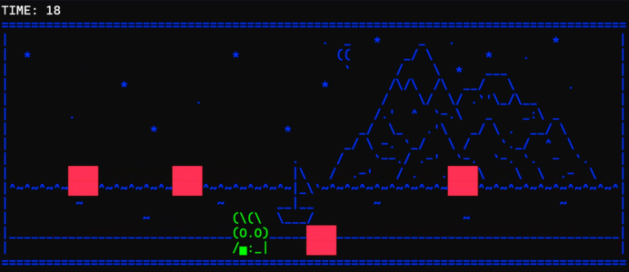
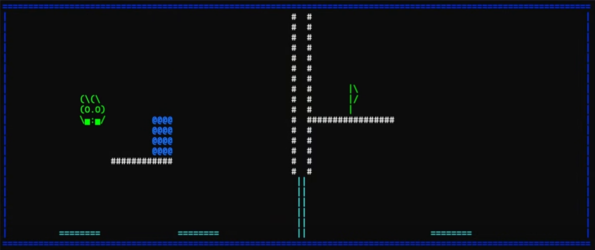

An engine for creating 2D terminal-based games, built without any graphics libraries.

- Framerate-independent simulation (delta-time based)
- Efficient rendering (only the changing parts of the terminal are reprinted)
- Particle system
- Collision system (OnCollisionEnter/Exit)
- Sorting layer system
- Easy to add new levels / objects
- Backgrounds support

#
<b>How to build (cmake):</b>

Enter EngineDemo/build and run this commands:
- cmake -S ../ -O ./
- cmake --build .

#
<b>Notes:</b>
- Windows only (project depends on windows terminal API)
- Requires you to install [OpenAL DLL](https://www.openal.org/downloads/)

#
[Youtube Trailer](https://www.youtube.com/watch?v=TqpGVI95oNU&ab_channel=Nicol%C3%B2Bertoli)

